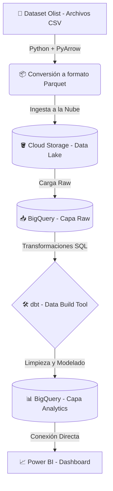

# 🛒 E-commerce Modern Data Pipeline (GCP & dbt)

Este proyecto es un pipeline de datos End-to-End (ELT) que simula la ingesta y transformación de datos transaccionales de un E-commerce usando el "Modern Data Stack".

## 🏗️ Arquitectura del Proyecto

1. **Extracción (Extract):** Scripts en Python extraen datos locales (formato CSV), los convierten a formato columnar **Parquet** (para optimizar costos y rendimiento) y los suben a la nube.
2. **Data Lake (Load):** Los archivos crudos se almacenan en **Google Cloud Storage (GCS)**.
3. **Data Warehouse:** Desde Python, se orquesta la carga de los datos desde GCS hacia **Google BigQuery** (capa `raw`).
4. **Transformación (Transform):** Usando **dbt (Data Build Tool)**, se limpian, estandarizan y modelan los datos usando SQL para pasarlos a la capa `analytics`, listos para ser consumidos por herramientas de BI.

## 🛠️ Tecnologías Utilizadas
* **Lenguaje:** Python (Pandas, PyArrow)
* **Cloud Provider:** Google Cloud Platform (GCP)
* **Data Lake:** Google Cloud Storage
* **Data Warehouse:** Google BigQuery
* **Transformación:** dbt (Data Build Tool)
* **Control de Versiones:** Git & GitHub

## 🚀 Cómo ejecutar este proyecto

### 1. Prerrequisitos
* Tener una cuenta en Google Cloud y un proyecto creado.
* Instalar Google Cloud CLI y autenticarse con `gcloud auth application-default login`.
* Python 3.8+ y un entorno virtual configurado.

### 2. Configuración del entorno
```bash
# Clonar el repositorio
git clone https://github.com/Hanser193/gcp-dbt-ecommerce-pipeline.git
cd gcp-dbt-ecommerce-pipeline

# Instalar dependencias
pip install google-cloud-storage google-cloud-bigquery pyarrow pandas dbt-bigquery

### 3. Ejecución del Pipeline
# Paso 1: Subir datos a Google Cloud Storage
python upload_to_gcs.py

# Paso 2: Cargar datos de GCS a BigQuery
python load_to_bigquery.py

# Paso 3: Transformar datos en BigQuery con dbt
cd ecommerce_dbt
dbt run
